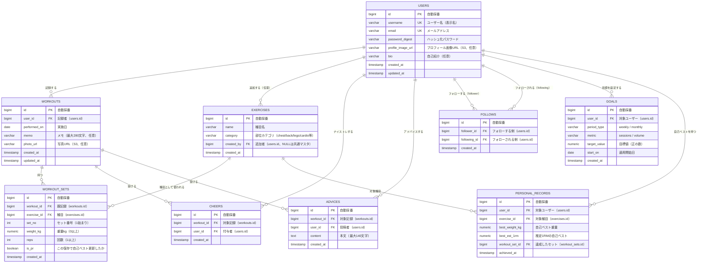

# データベース設計書

関連: [要件定義書](requirements.md) / [機能要件書](functional-requirements.md)

## 1. エンティティ一覧

| エンティティ | テーブル名 | 役割 |
| --- | --- | --- |
| ユーザー | users | アプリの利用者 |
| 種目マスタ | exercises | トレーニング種目（ベンチプレス等）。共通＋ユーザー追加 |
| トレーニング記録 | workouts | 実施日単位の記録（1日1件想定だが日付＋ユーザーで複数可） |
| セット | workout_sets | 記録内の `種目 × 重量 × 回数` の1セット |
| ナイストレ | cheers | 記録への「ナイストレ」（いいね相当） |
| アドバイス | advices | 記録へのコメント（応援/助言） |
| フォロー | follows | ユーザー間のフォロー/フォロワー関係 |
| 目標 | goals | 週間/月間の目標設定 |
| 自己ベスト | personal_records | 種目別の自己ベスト（PR判定の基準値） |

---

## 2. ER図（Mermaid）

---

## 3. テーブル定義（主要カラム）

### 3.1 users

| カラム | 型 | NULL | キー | デフォルト | 説明 |
| --- | --- | --- | --- | --- | --- |
| id | BIGINT | NOT NULL | PK | 自動採番 | ユーザーID |
| username | VARCHAR(50) | NOT NULL | UK | - | ユーザー名 |
| email | VARCHAR(255) | NOT NULL | UK | - | メールアドレス |
| password_digest | VARCHAR(255) | NOT NULL | - | - | Bcryptハッシュ |
| profile_image_url | VARCHAR(1000) | NULL | - | NULL | プロフィール画像URL（S3） |
| bio | VARCHAR(160) | NULL | - | NULL | 自己紹介 |
| created_at / updated_at | TIMESTAMP | NOT NULL | - | CURRENT_TIMESTAMP | 作成/更新日時 |

### 3.2 exercises

| カラム | 型 | NULL | キー | 説明 |
| --- | --- | --- | --- | --- |
| id | BIGINT | NOT NULL | PK | 種目ID |
| name | VARCHAR(100) | NOT NULL | - | 種目名 |
| category | VARCHAR(30) | NOT NULL | - | 部位カテゴリ |
| created_by | BIGINT | NULL | FK | 追加者（NULL=共通マスタ） |
| created_at | TIMESTAMP | NOT NULL | - | 作成日時 |

### 3.3 workouts

| カラム | 型 | NULL | キー | 説明 |
| --- | --- | --- | --- | --- |
| id | BIGINT | NOT NULL | PK | 記録ID |
| user_id | BIGINT | NOT NULL | FK | 記録者（users.id） |
| performed_on | DATE | NOT NULL | - | 実施日 |
| memo | VARCHAR(280) | NULL | - | メモ |
| photo_url | VARCHAR(1000) | NULL | - | 写真URL（S3） |
| created_at / updated_at | TIMESTAMP | NOT NULL | - | 作成/更新日時 |

### 3.4 workout_sets

| カラム | 型 | NULL | キー | 説明 |
| --- | --- | --- | --- | --- |
| id | BIGINT | NOT NULL | PK | セットID |
| workout_id | BIGINT | NOT NULL | FK | 親記録（workouts.id） |
| exercise_id | BIGINT | NOT NULL | FK | 種目（exercises.id） |
| set_no | INT | NOT NULL | - | セット番号（1始まり） |
| weight_kg | NUMERIC(6,2) | NOT NULL | - | 重量kg（0以上） |
| reps | INT | NOT NULL | - | 回数（1以上） |
| is_pr | BOOLEAN | NOT NULL | - | 自己ベスト更新フラグ（default false） |
| created_at | TIMESTAMP | NOT NULL | - | 作成日時 |

### 3.5 cheers / advices / follows / goals / personal_records

- **cheers**: id, workout_id(FK), user_id(FK), created_at
- **advices**: id, workout_id(FK), user_id(FK), content TEXT, created_at
- **follows**: id, follower_id(FK), following_id(FK), created_at
- **goals**: id, user_id(FK), period_type VARCHAR, metric VARCHAR, target_value NUMERIC, start_on DATE, created_at
- **personal_records**: id, user_id(FK), exercise_id(FK), best_weight_kg, best_est_1rm, workout_set_id(FK), achieved_at

---

## 4. インデックス

| テーブル | インデックス | カラム | 種別 | 目的 |
| --- | --- | --- | --- | --- |
| users | idx_users_email | email | UNIQUE | ログイン・一意性 |
| users | idx_users_username | username | UNIQUE | 検索・一意性 |
| workouts | idx_workouts_user_date | (user_id, performed_on DESC) | INDEX | 記録一覧・集計・ストリーク |
| workout_sets | idx_sets_workout | workout_id | INDEX | 記録のセット取得 |
| workout_sets | idx_sets_user_exercise | (exercise_id) | INDEX | 種目別PR算出 |
| cheers | uq_cheers_workout_user | (workout_id, user_id) | UNIQUE | 重複ナイストレ防止 |
| advices | idx_advices_workout | (workout_id, created_at ASC) | INDEX | アドバイス昇順取得 |
| follows | uq_follows_pair | (follower_id, following_id) | UNIQUE | 重複フォロー防止 |
| follows | idx_follows_follower / following | follower_id / following_id | INDEX | フォロー中/フォロワー一覧 |
| goals | uq_goals_user_period | (user_id, period_type) | UNIQUE | 同一期間種別の目標は1件 |
| personal_records | uq_pr_user_exercise | (user_id, exercise_id) | UNIQUE | 種目別PRは1行 |

---

## 5. 制約

### UNIQUE 制約

- users.email / users.username: 重複登録禁止
- cheers(workout_id, user_id): 同一ユーザーの重複ナイストレ禁止
- follows(follower_id, following_id): 重複フォロー禁止
- goals(user_id, period_type): 同一ユーザー・同一期間種別の目標は1件
- personal_records(user_id, exercise_id): 種目別の自己ベストは1行

### 外部キー制約（ON DELETE CASCADE）

- workouts.user_id → users.id
- workout_sets.workout_id → workouts.id / workout_sets.exercise_id → exercises.id（種目は RESTRICT 検討）
- cheers / advices.workout_id → workouts.id（記録削除で連動削除）
- follows.follower_id / following_id → users.id
- goals.user_id → users.id / personal_records.user_id → users.id

### CHECK 制約

- workout_sets.weight_kg >= 0、workout_sets.reps >= 1、workout_sets.set_no >= 1
- goals.target_value > 0、goals.period_type ∈ ('weekly','monthly')、goals.metric ∈ ('sessions','volume')
- follows: follower_id ≠ following_id（自分自身のフォロー禁止）
- advices.content: LENGTH >= 1（上限140文字はアプリ側バリデーション）

---

## 6. 集計クエリ方針（継続の工夫を支える）

- **週間/月間集計（F-07）**: `date_trunc('week'|'month', performed_on)` で期間バケット化し、
  実施回数（COUNT DISTINCT workout）または総ボリューム（SUM(weight_kg * reps)）を集計
- **ヒートマップ（F-08）**: `generate_series(start, end, '1 day')` で日付軸を生成し、日別記録量を LEFT JOIN（欠損日も0表示）
- **ストリーク（F-08）**: 記録のある実施日の集合に対し連番との差分（gaps-and-islands）で連続区間を算出
- **自己ベスト（F-09）**: 種目別に MAX(weight_kg) / MAX(推定1RM) をウィンドウ関数で算出し基準値と比較

---

## 7. 将来の拡張（スコープ外）

- `notifications` テーブル: ナイストレ・アドバイス・フォロー通知
- `badges` / `user_badges` テーブル: 実績バッジの多数展開
- `direct_messages` テーブル: DM機能
