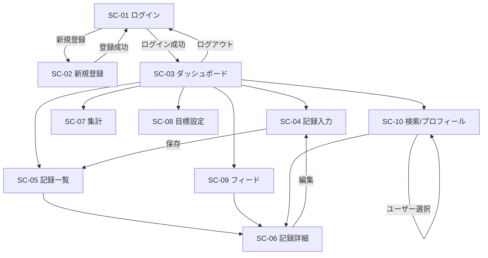

# 画面設計書

関連: [要件定義書](requirements.md) / [機能要件書](functional-requirements.md) / [データベース設計書](database-design.md)

## 1. 画面一覧

| 画面ID | 画面名 | 認証 | 対応機能 | 概要 |
| --- | --- | --- | --- | --- |
| SC-01 | ログイン | 不要 | F-01 | メール＋パスワードでログイン |
| SC-02 | 新規登録 | 不要 | F-01 | ユーザー名・メール・パスワードで登録 |
| SC-03 | ダッシュボード | 必要 | F-07,F-08,F-09 | 達成率リング・ストリーク・ヒートマップ・自己ベスト3指標 |
| SC-04 | 記録入力 | 必要 | F-02,F-10 | 実施日・種目・セット・メモ・写真を記録/編集 |
| SC-05 | 記録一覧 | 必要 | F-03 | 自分の記録を日別・時系列で一覧 |
| SC-06 | 記録詳細 | 必要 | F-03,F-04,F-05,F-09 | セット内訳・写真・PRバッジ・ナイストレ/アドバイス |
| SC-07 | 集計 | 必要 | F-07 | 週間/月間ボリューム棒グラフ・達成率推移 |
| SC-08 | 目標設定 | 必要 | F-07 | 期間種別・指標・目標値の設定 |
| SC-09 | フィード | 必要 | F-06,F-04,F-05 | フォロー中ユーザーの記録一覧・応援 |
| SC-10 | ユーザー検索/プロフィール | 必要 | F-06 | ユーザー検索・フォロー・フォロー中/フォロワー一覧 |
| 共通 | グローバルナビ | 必要 | - | ヘッダー/サイドのナビゲーション |

---

## 2. 画面遷移図（Mermaid）



---

## 3. 共通レイアウト

```text
+----------------------------------------------------------+
| [FitLog]   ダッシュボード 記録 一覧 集計 フィード   [👤▾] |  ← グローバルナビ
+----------------------------------------------------------+
|                                                          |
|                   各画面コンテンツ                       |
|                                                          |
+----------------------------------------------------------+
```

- ナビ項目: ダッシュボード(SC-03) / 記録(SC-04) / 一覧(SC-05) / 集計(SC-07) / フィード(SC-09)
- 右上ユーザーメニュー: プロフィール(SC-10) / 目標設定(SC-08) / ログアウト
- 未ログイン時は SC-01/SC-02 のみ（ナビ非表示）

---

## 4. 画面別ワイヤーフレーム＆要件

### SC-01 ログイン

```text
+---------------------------+
|         FitLog            |
|  メールアドレス [_______] |
|  パスワード     [_______] |
|        [ ログイン ]       |
|  アカウント未作成？ 新規登録 |
+---------------------------+
```

- 表示項目: メール、パスワード、ログインボタン、新規登録リンク
- 操作: ログイン（成功→SC-03、失敗→エラーメッセージ）
- バリデーション: 必須入力。失敗時「メールアドレスまたはパスワードが正しくありません」

### SC-02 新規登録

```text
+---------------------------+
|       新規登録            |
|  ユーザー名   [_______]   |
|  メール       [_______]   |
|  パスワード   [_______]   |
|        [ 登録する ]       |
|  既にアカウントあり？ ログイン |
+---------------------------+
```

- バリデーション: ユーザー名/メール一意、パスワード8文字以上英数字混在
- 操作: 登録成功→SC-01へ遷移

### SC-03 ダッシュボード（継続の工夫の中心）

```text
+----------------------------------------------------------+
|  今週の目標達成率           現在のストリーク              |
|     ◯ 66%  (週3回中2回)        🔥 5日連続 (最長 12日)     |
+----------------------------------------------------------+
|  記録ヒートマップ（直近5ヶ月）                           |
|  □□■□■ ■■□■□ □■■■■ ... (濃淡=ボリューム)               |
+----------------------------------------------------------+
|  自己ベスト（種目別・3指標を併記）                       |
|  ベンチプレス                                            |
|   ①最大重量 75kg (6回/05-18) ②ベストVol 1,610kg (05-18) |
|   ③推定1RM 90kg (75kg×6/05-18)                          |
|  スクワット ①100kg ②1,140kg ③116.7kg ...               |
+----------------------------------------------------------+
|  [ 今日の記録をつける → SC-04 ]                          |
+----------------------------------------------------------+
```

- 表示項目: 達成率リング(F-07)、ストリーク現在/最長(F-08)、ヒートマップ(F-08)、自己ベスト3指標(F-09)
- 自己ベスト(F-09)は種目別に3指標を併記:
  - **① 最大重量**: 回数を問わない最大kg（達成回数・日付）
  - **② ベストボリューム**: 1記録での種目Σ(重量×回数×全セット)の自己最高（日常の進捗＝漸進的過負荷の主指標）
  - **③ 推定1RM**: Epley式・参考値（10レップ超は参考）
- 有酸素/自重種目（重量0）は重量/1RM/ボリューム指標が機能しないため自己ベスト非表示
- 操作: 記録入力(SC-04)へのCTA、各ウィジェットから集計(SC-07)/一覧(SC-05)へ
- データなし時: 「まだ記録がありません。最初の記録をつけましょう」

### SC-04 記録入力

```text
+----------------------------------------------------------+
|  実施日 [2026-05-18 ▾]                                   |
|  ── 種目1: [ベンチプレス ▾] (+種目を追加)               |
|     セット1  重量[60]kg  回数[10]   [×]                  |
|     セット2  重量[70]kg  回数[ 8]   [×]   [+ セット追加] |
|  ── 種目2: [ ... ]                                       |
|  メモ [____________________________]                     |
|  写真 [ファイル選択]  (JPEG/PNG, 5MBまで)                |
|              [ 保存 ]   [ キャンセル ]                   |
+----------------------------------------------------------+
```

- 表示項目: 実施日、種目（マスタ選択＋新規追加）、セット（重量×回数, 動的追加/削除）、メモ、写真
- バリデーション: 種目1件以上・各種目セット1件以上、重量≥0、回数≥1、メモ≤280、写真形式/サイズ
- 操作: 保存（F-09判定実行→SC-05へ）、編集時は既存値プリセット
- 保存後フィードバック: 自己ベスト更新があれば「🎉 ベンチプレスで自己ベスト更新！」をトースト表示

### SC-05 記録一覧

```text
+----------------------------------------------------------+
|  2026-05-18  種目3 / 8セット  総ボリューム 4,200kg  ♡2 💬1 |
|  2026-05-16  種目2 / 5セット  総ボリューム 2,600kg  ♡0 💬0 |
|  ...                                          (実施日降順) |
+----------------------------------------------------------+
```

- 表示項目: 実施日、種目数/セット数、総ボリューム、ナイストレ数、アドバイス数、写真サムネ
- 操作: 行クリックで詳細(SC-06)、無限スクロールまたはページング

### SC-06 記録詳細

```text
+----------------------------------------------------------+
|  2026-05-18  (自分の記録なら [編集] [削除])               |
|  ベンチプレス  60×10 / 70×8 / 75×6   [自己ベスト更新🏅]  |
|  スクワット    100×5 / 100×5                             |
|  メモ: 調子良かった                                      |
|  [写真]                                                  |
|  ── ナイストレ 2 ──  [👍 ナイストレ]                     |
|  ── アドバイス ──                                        |
|   ユーザーA: フォーム意識できてていいですね (応援/削除)   |
|   [コメント入力__________] [送信]                        |
+----------------------------------------------------------+
```

- 表示項目: セット内訳、PRバッジ(F-09)、メモ、写真、ナイストレ(F-04)、アドバイス(F-05)
- PRバッジ(F-09): その記録で更新した指標を区別して表示（①最大重量 / ②ベストボリューム / ③推定1RM のどれを更新したか）
- 操作: 本人=編集(SC-04)/削除（確認ダイアログ）、他者=ナイストレ付与/解除・アドバイス投稿、自分のアドバイス削除

### SC-07 集計

```text
+----------------------------------------------------------+
|  期間: [週間 ▾]                                          |
|  総ボリューム  ▮▮▮ ▮▮▮▮▮ ▮▮ ▮▮▮▮ (週ごと棒グラフ)       |
|  達成率推移    ──╱──╲──╱── (折れ線, 目標ライン重畳)      |
+----------------------------------------------------------+
```

- 表示項目: 週間/月間切替、総ボリューム棒グラフ、達成率推移ライン（目標値ライン）
- データ: `date_trunc` による期間集計（F-07）

### SC-08 目標設定

```text
+---------------------------+
|  期間種別 [週間 ▾]        |
|  指標     [実施回数 ▾]    |  (実施回数 / 総ボリューム)
|  目標値   [ 3 ]           |
|        [ 保存 ]           |
|  現在の目標: 週3回         |
+---------------------------+
```

- バリデーション: 目標値>0、period_type∈{weekly,monthly}、metric∈{sessions,volume}
- 操作: 保存（同一期間種別は上書き）。保存後ダッシュボード達成率へ反映

### SC-09 フィード

```text
+----------------------------------------------------------+
|  フォロー中の記録（新着順）                              |
|  ユーザーB 2026-05-18  ベンチ80×5 ...   [👍] [💬]        |
|  ユーザーC 2026-05-17  ランニング 5km   [👍] [💬]        |
+----------------------------------------------------------+
```

- 表示項目: フォロー中ユーザーの記録カード（投稿者・実施日・要約・ナイストレ/アドバイス）
- 操作: カードから詳細(SC-06)、ナイストレ/アドバイス、未フォロー時は誘導

### SC-10 ユーザー検索/プロフィール

```text
+----------------------------------------------------------+
|  検索 [ユーザー名_______] 🔍                             |
|  - ユーザーD   [フォロー中]                              |
|  - ユーザーE   [フォローする]                            |
|  --- プロフィール ---                                    |
|  ユーザーD  フォロー 12 / フォロワー 8                   |
|  最近の記録 ...                                          |
+----------------------------------------------------------+
```

- 表示項目: 検索結果（フォロー状態付き）、プロフィール（フォロー/フォロワー数、最近の記録）
- 操作: フォロー/アンフォロー（自分不可・重複不可）、フォロー中/フォロワー一覧、記録詳細へ

---

## 5. 状態・エラー表示の共通方針

| 状態 | 表示 |
| --- | --- |
| ローディング | スケルトン or スピナー |
| データ空 | 各画面に「まだ〇〇がありません」＋次アクション誘導 |
| 入力エラー | 該当フィールド直下に赤字メッセージ |
| 通信エラー | トーストで「通信に失敗しました。再試行してください」 |
| 認証切れ | SC-01 へリダイレクト |

---

## 6. レスポンシブ方針

- モバイルファースト。ナビはモバイルで下部タブ or ハンバーガー
- ダッシュボードのウィジェットは縦積み、グラフは横スクロール許容
- 記録入力はモバイルでの片手操作を想定（セット追加ボタンを大きく）
